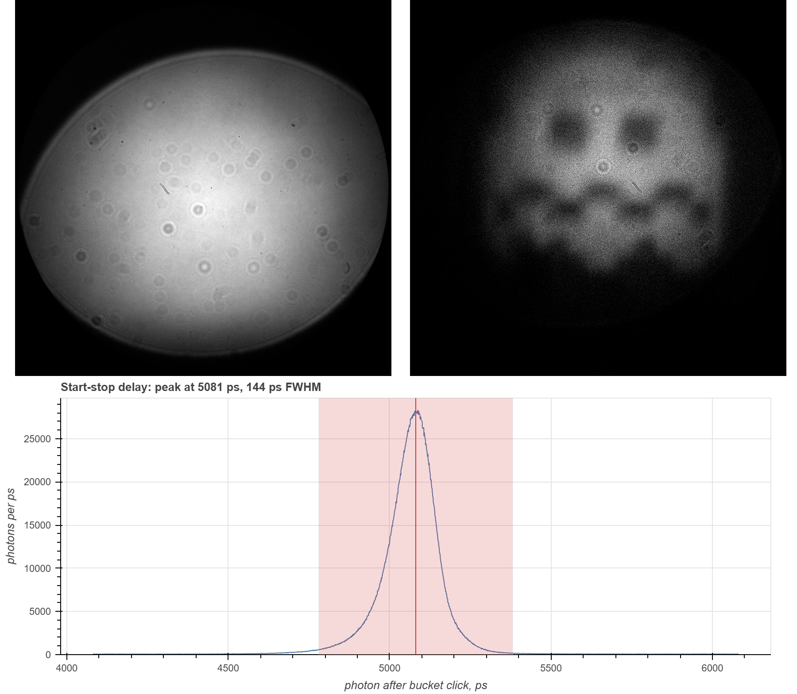

# 1 · Quantum ghost imaging with a LINCam



*Left: every photon the camera saw, 244 million of them, showing the bare
crystal face. Right: the 1.94 % that arrived within ±300 ps of the coincidence
peak, showing a sample the camera never looked at. Below: the start-stop
histogram the cut was made in, 1 ps a bin.*

A photon pair is born in a PPKTP crystal. The visible **signal** photon is
imaged onto the LINCam and never meets the sample; the infrared **idler** goes
through the sample onto a single-pixel "bucket" detector, an infrared SPAD that
sees no picture at all. Its pulse drives the LINCam's reference input, so every
photon in the file carries two picosecond time stamps, its own and that of the
last bucket click before it, and the pairs can be found afterwards: a signal
photon whose twin made it through the sample arrives a fixed delay after the
click.

The setup is that of Ryan *et al.*,
[Optica **11**, 1261 (2024)](https://doi.org/10.1364/OPTICA.527982), with a
LINCam as the imaging detector. The application note itself:
[photonscore.de/appnotes/1](https://www.photonscore.de/appnotes/1).

## Install

Get [uv](https://docs.astral.sh/uv/getting-started/installation/), then paste
one line in this folder. It fetches Python 3.12 as well, and the `photonscore`
package as [photonscore.de](https://www.photonscore.de/support/downloads) has it.

Windows:

```powershell
uv venv --python 3.12; uv pip install jupyterlab bokeh https://www.photonscore.de/support/downloads/26.0.26/photonscore-26.0.26-windows-py3.12.zip
```

macOS:

```bash
uv venv --python 3.12; uv pip install jupyterlab bokeh https://www.photonscore.de/support/downloads/26.0.26/photonscore-26.0.26-mac-py3.12.zip
```

Linux:

```bash
uv venv --python 3.12; uv pip install jupyterlab bokeh https://www.photonscore.de/support/downloads/26.0.26/photonscore-26.0.26-linux-py3.12.zip
```

## Data

- [ghost-dataset.photons](https://www.photonscore.de/appnotes/1/data/ghost-dataset.photons)
  — the recording: 243,797,041 photons over 500 s, 3.1 GB.
- [ghost-only.photons](https://www.photonscore.de/appnotes/1/data/ghost-only.photons)
  — the 3,845,868 photons within ±100 ps of the peak, 54 MB, as `--save`
  writes them. Small enough to open at once in
  [Photonscore Preview](https://www.photonscore.de/support/downloads).

Recorded by Duncan Ryan of Los Alamos National Laboratory on his QGI setup,
and shared here with his kind permission.

## Run

```bash
uv run ghost.py ghost-dataset.photons --window 300 --png
```

Ten to twenty seconds for the 3.1 GB on a desktop: it streams the file in
chunks, so the memory in use does not grow with it. It prints the peak it found and writes
`ghost-dataset.ghost.html`, the two images and the histogram as interactive
plots.

| option | |
| --- | --- |
| `--window PS` | half width of the cut around the peak, 100 ps unless said |
| `--bins N` | pixels along each side of the images: 512, 1024 or 2048 |
| `--png` | also write `<input>.full.png` and `<input>.ghost.png`, 8-bit grayscale |
| `--save FILE` | also write the selected photons as a `.photons` file |
| `--html FILE` | where the plots go |

The notebook walks through the same three steps, a plot after each, and shows
what a wider or a narrower window would cost in accidentals:

```bash
uv run jupyter lab ghost.ipynb
```

## What the script does

1. **Histograms every photon** by position: the full image.
2. **Histograms `start - stop`**, the photon's arrival after the last bucket
   click, at 1 ps a bin. True pairs pile up at one delay, set by cable lengths
   and optical paths; everything else is an accidental and spreads flat. In
   this recording the peak stands at 5081 ps and is 144 ps wide (FWHM), over a
   floor of 60 accidentals per ps.
3. **Keeps the photons under the peak** and histograms those: the ghost image.
   At ±100 ps that is 3.8 million photons, 0.3 % of them accidental; at ±300 ps
   4.7 million and 0.8 %.

What it reads from the file:

| dataset | | |
| --- | --- | --- |
| `/photons/x`, `/photons/y` | `uint16` | position, 12 bit |
| `/start/time` | `uint64` | the photon's own arrival time, ps |
| `/stop/time` | `uint64` | the last bucket click before it, ps |
| `/photons/ms` | `uint64` | index of the first photon of every millisecond |

The recorded `/photons/dt` holds the same delay in 100 ps channels, too coarse
for a peak 144 ps wide, and is not read. A file written by `--save` carries the
picosecond delay there instead, at 1 ps a channel, so Preview's decay plot draws
the peak as it was resolved.
